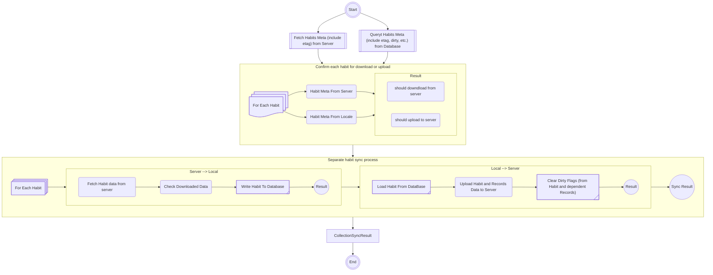
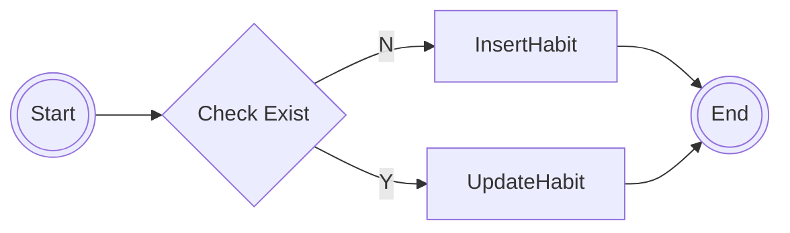
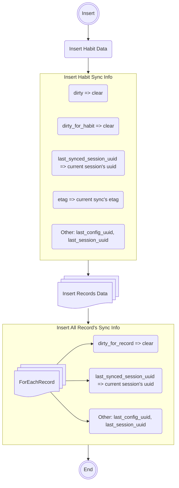
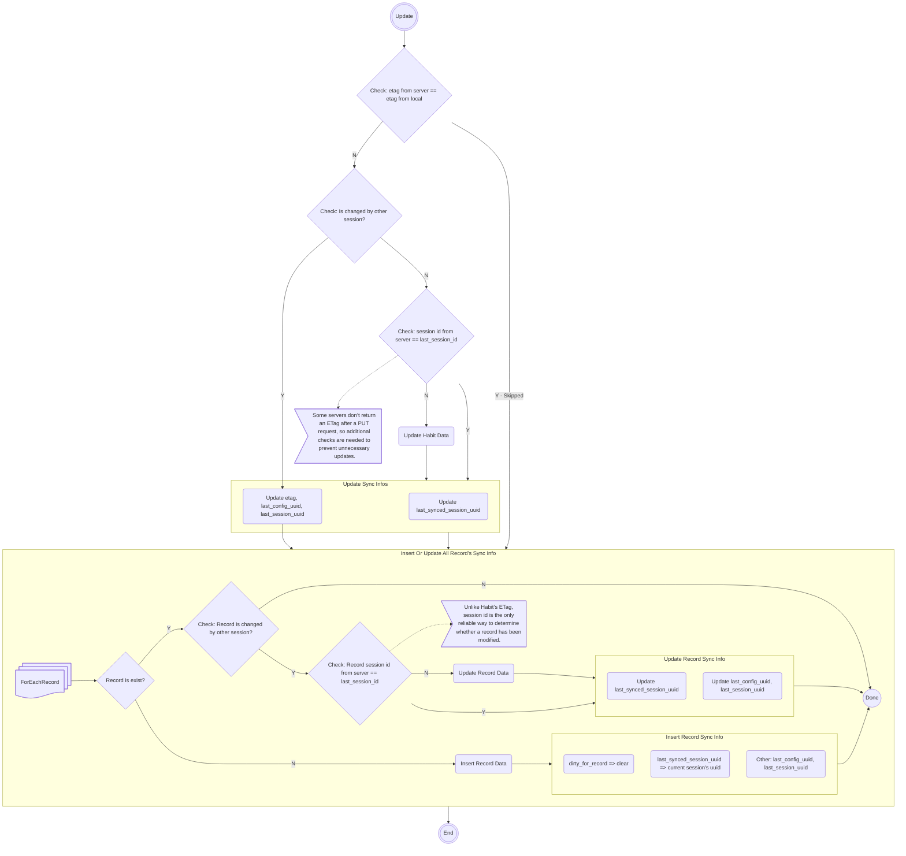
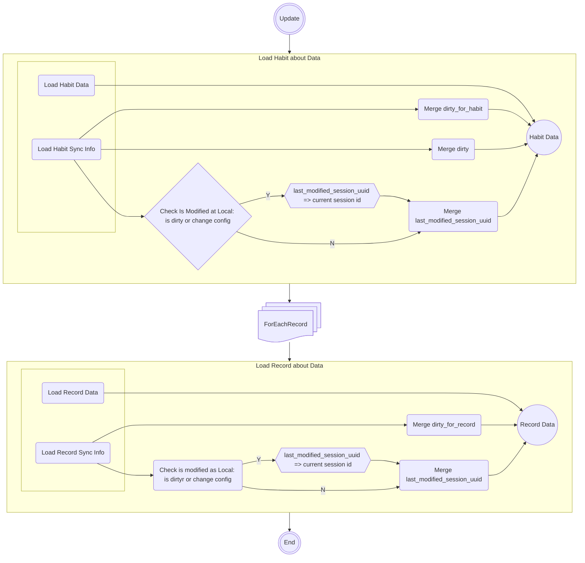
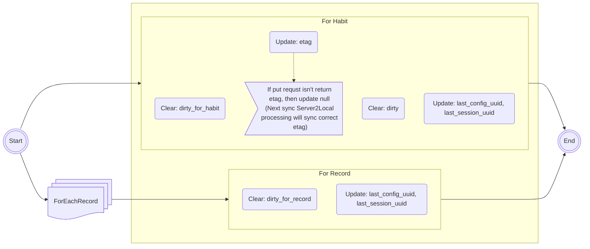
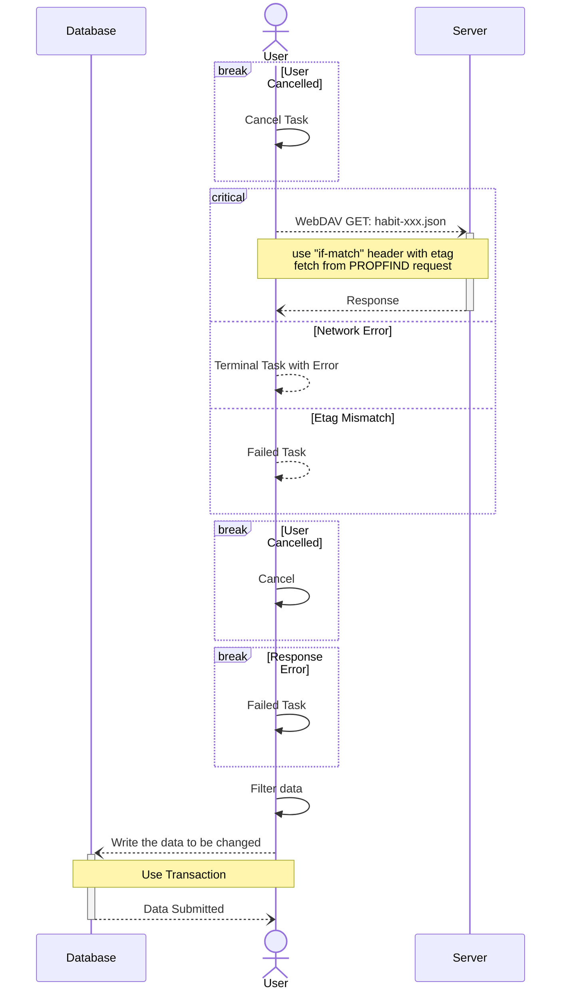
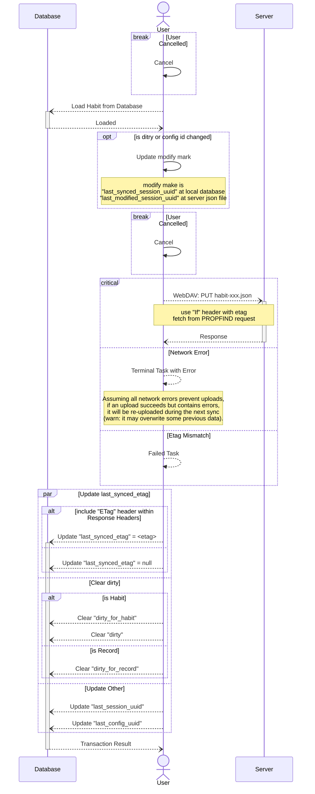

<!--
 Copyright 2025 Fries_I23

 Licensed under the Apache License, Version 2.0 (the "License");
 you may not use this file except in compliance with the License.
 You may obtain a copy of the License at

     https://www.apache.org/licenses/LICENSE-2.0

 Unless required by applicable law or agreed to in writing, software
 distributed under the License is distributed on an "AS IS" BASIS,
 WITHOUT WARRANTIES OR CONDITIONS OF ANY KIND, either express or implied.
 See the License for the specific language governing permissions and
 limitations under the License.
-->

# WebDAV Sync Design Overview

The smallest unit for determining differences between the client and server is **Habit**.

- Server to Client:
  - Habit's `etag` changes.
  - Habit doesn't exist on client.
- Client to Server:
  - Habit marked as `dirty`
  - Habit doesn't exist on server.
  - Client’s path configuration has changed.

## Data Design

### Local

| Habit / Designed Field   | Implemented Field         | Desc.                                                                                                        |
| ------------------------ | ------------------------- | ------------------------------------------------------------------------------------------------------------ |
| dirty                    | mh_sync.dirty_total       | Mark if any field of habit or corresponding record changes.                                                  |
| dirty_for_habit          | mh_sync.dirty             | Mark if any field of habit changes                                                                           |
| last_config_uuid         | mh_sync.last_config_uuid  | The UUID of the last server configuration                                                                    |
| last_session_uuid        | mh_sync.last_session_uuid | The UUID of the last sync session                                                                            |
| last_synced_etag         | mh_sync.last_mark_2       | The etag of the last sync represents the version of the data when it was last fetched from the server.       |
| last_synced_session_uuid | mh_sync.last_mark         | The session ID of the last sync where data was fetched from the server and actually written to the local DB. |

| Record / Designed Field  | Implemented Field         | Desc.                                                                                                        |
| ------------------------ | ------------------------- | ------------------------------------------------------------------------------------------------------------ |
| dirty_for_record         | mh_sync.dirty             | Mark if any field of record changes.                                                                         |
| last_config_uuid         | mh_sync.last_config_uuid  | The UUID of the last server configuration.                                                                   |
| last_session_uuid        | mh_sync.last_session_uuid | The UUID of the last sync session.                                                                           |
| last_synced_session_uuid | mh_sync.last_mark         | The session ID of the last sync where data was fetched from the server and actually written to the local DB. |

### Server

| Habit / Designed Field     | Implemented Field               | Desc.                                                                    |
| -------------------------- | ------------------------------- | ------------------------------------------------------------------------ |
| <...Habit Data>            | -                               | see [WebDavSyncHabitData][file.webdav_app_sync_models.dart] for details. |
| last_modified_session_uuid | `WebDavSyncHabitData.sessionId` | The UUID of the session that was last modified from client.              |

| Record / Designed Field    | Implemented Field                | Desc.                                                                     |
| -------------------------- | -------------------------------- | ------------------------------------------------------------------------- |
| <...Record Data>           | -                                | see [WebDavSyncRecordData][file.webdav_app_sync_models.dart] for details. |
| last_modified_session_uuid | `WebDavSyncRecordData.sessionId` | The UUID of the session that was last modified from client.               |

## Flow Design

### Main Task:

### Write Habit/Records to DB Task:

#### Insert Habit

#### Update Habit

### Load Habit/Records From DB Task:

### Clear Habit/Records Dirty Flags

## Sequence Design

### Single Habit: Server to Local Task

### Single Habit: Local to Server Task

<!-- refs -->

[file.webdav_app_sync_models.dart]: ../lib/model/_app_sync_tasks/webdav_app_sync_models.dart
