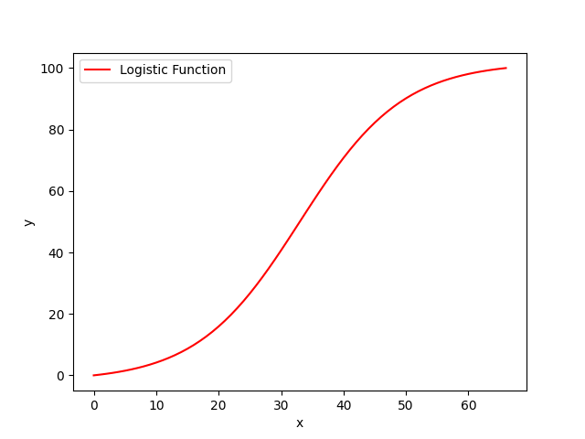

<!-- markdownlint-disable no-inline-html first-line-heading -->

This wiki was written based on version [1.72.2+95][v1.72.2+95].
Any subsequent changes are subject to the in-app behavior.

## 1. Formula

The habit growth curve is based on a **Sigmoid function**.

### 1.1. Input mapping

For a day `x` in `[0, days]`, map it to `[-10, 10]`:

$$
X = (b_2 - b_1) \frac{x - a_1}{a_2 - a_1} + b_1
$$

Where:

- $a_1 = 0$, $a_2 = \text{days}$
- $b_1 = -10$, $b_2 = 10$

So explicitly:

$$
X = 20 \cdot \frac{x}{\text{days}} - 10
$$

#### 1.2. Core function

$$
Y = \frac{1}{1 + e^{-k (X - x_0)}}
$$

Where:

- $k = 0.4$ (growth rate)
- $x_0 = 0$ (center point)

### 1.3. Output mapping (optional)

If the output should be mapped from an interval $[c_1, c_2]$ to $[d_1, d_2]$:

$$
y = (d_2 - d_1) \frac{y - c_1}{c_2 - c_1} + d_1
$$

Where:

- $[c_1, c_2] = \text{interv}$
- $[d_1, d_2] = \_defaultInterv$ (Default: [0, 100])

## 2. Inverse Formula

This function calculates the **day `x` corresponding to a given habit score `y`**, i.e., the inverse of the habit growth curve.

### 2.1. Output mapping (inverse of interval mapping)

First, map the output `y` from an interval $[d_1, d_2]$ back to $[c_1, c_2]$:

$$
Y = (c_2 - c_1) \frac{y - d_1}{d_2 - d_1} + c_1
$$

Where:

- $[c_1, c_2] = \text{interv}$
- $[d_1, d_2] = \_defaultInterv$ (Default: [0, 100])

### 2.2. Inversed Core

The Sigmoid inverse (logit function) is applied:

$$
X = x_0 - \frac{1}{k} \ln \left( \frac{1}{Y} - 1 \right)
$$

Where:

- $k = 0.4$ (growth rate)
- $x_0 = 0$ (center point)

### 2.3. Input mapping (back to days)

Finally, map `X` from `[-10, 10]` back to `[0, days]`:

$$
x = (a_2 - a_1) \frac{X - b_1}{b_2 - b_1} + a_1
$$

Where:

- $[a_1, a_2] = [0, \text{days}]$
- $[b_1, b_2] = [-10, 10]$

So explicitly:

$$
x = \text{days} \cdot \frac{X + 10}{20}
$$

## 3. Habit Growth

- **Target Days**: Minimum number of days required to complete a habit.
- **Daily Goal**: Minimum quantity required for single day.
- **Incomplete**: Daily Goal completely not completed; in positive habits, this is usually 0.
- **Partially Completed**: Daily Goal not completed; for positive habits, the value is usually with `0 < num < Daily Goal`.
- **Overachieved**: The final number exceeds the value set for the Daily Goal, usually with `num > Daily Goal`
- **Overage Threshold**: Maximum value the number can increase after exceeding the Daily Goal

### 3.1. Growth Score

For a positive habit, when the $DailyNumber ≥ DailyGoal$, an increase of $[1, 1.5]$ is applied relative to the corresponding days of the Target Days, then [Formula](#1-formula) converts it into the final score.

For a negative habit, simply replace $≥ DailyGoal$ with:

$$
0 ≤ DailyNumber ≤ DailyGoal
$$

### 3.2. Decline Score

For a positive habit, when the $0 ≤ DailyNumber ≤ DailyGoal$, a reduction of $[100 ÷ TargetDays ÷ 2, 100 ÷ TargetDays]$ in score is applied, which can be used with the [Inverse Formula](#2-inverse-formula) to reverse-calculate the corresponding new total days.

For a negative habit, simply replace $0 ≤ DailyNumber ≤ DailyGoal$ with:

$$
DailyGoal < DailyNumber ≤ OverageThreshold ...
$$

When the number exceeds the **Overage Threshold**, take the maximum value ($100 ÷ TargetDays$).

## 4. Example

<!-- refs -->

[v1.72.2+95]: https://github.com/FriesI23/mhabit/releases/tag/v1.17.2+95
