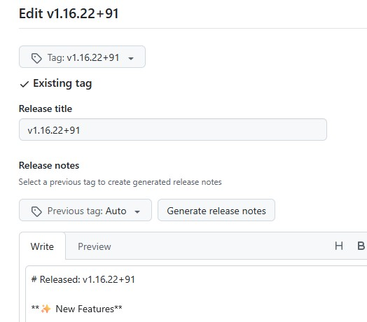

<!-- markdownlint-disable no-inline-html first-line-heading -->

## 1. Bump App Version

> - [x] stable
> - [x] beta

1. Modify `pubspec.yaml` and change `version` param.

> Use the `x.y.z+a` format for stable versions and `x.y.z+a-pre` for beta.

1. Ensure the generated code is up-to-date by executing:

   ```shell
   flutter clean
   flutter pub get
   scripts/normalize_arb.sh
   scripts/build_runner.sh
   ```

## 2. Update Release Description

> - [x] stable
> - [x] beta

Add Release change log in `docs/release.md`,
Release-CI will use this file to automatically fill in [Release][github-release] description.

> Change SHOULD include: `<previous stable version>...<current version>`.

## 3. Update Changelog

> - [x] stable
> - [ ] beta

Add the release changelog in `CHANGELOG.md`, keeping its content consistent with `docs/release.md`.

> Optionally, provide a translated changelog in `docs/CHANGELOG/<locale>.md`.

## 4. F-Droid

> - [x] stable
> - [ ] beta

Metainfo required by F-Droid must be included in repo along with current tag,
with Fastlane-compatible sturcture and format.

Update info can be auto-generated from `CHANGELOG.md` by executing:

```shell
scripts/gen_changelogs.sh
```

Or copy current version code change log from `CHANGELOG.md` to `{versionCode}.txt`
(create a new file if not exist) at `fastlane/metadata/android/en-us/changelogs` manually.

> Optionally, Add translation text at `fastlane/metadata/android/<locale>/changelogs`.

## 5. Flatpak / Flathub

> - [x] stable
> - [x] beta

Metainfo required by Flathub must be included in repo along with current tag,
with AppStream-compatible format.

Update info can be auto-generated by executing:

```shell
scripts/gen_flatpak_info.sh
```

Or add the following XML block manually:

```xml
<!-- insert under "component/releases" and before all other release nodes -->
<release version="{{new-version}}" date="{{yyyy-mm-dd}}">
    <url type="details">https://github.com/FriesI23/mhabit/releases/tag/{{new-version-tag}}</url>
</release>
```

- **Flatpak**: `configs/flatpak_builder/io.github.friesi23.mhabit.metainfo.xml`
- **Flathub**: `flatpak/io.github.friesi23.mhabit.metainfo.xml`
  > - [x] stable
  > - [ ] beta

Make sure new metainfo can pass Flathub's requirements checks:

```shell
flatpak run --command=flatpak-builder-lint org.flatpak.Builder appstream \
  io.github.friesi23.mhabit.metainfo.xml
```

## 6. Commit and Add Release Tag

> - [x] stable
> - [x] beta

Version tags that can trigger automatic CI builds support the following formats:

- Stable version: 'v[0-9]+.[0-9]+.[0-9]+\+[0-9]+'
  - e.g.: `v1.2.3+45`
- Beta version: 'pre-v[0-9]+.[0-9]+.[0-9]+\+[0-9]+'-
  - e.g: `pre-v1.2.3+45`

For more info, see: [App Release][ghci-app-release].

> - F-Droid periodically scans for specific tag format and its release to perform reproducible builds.
>   For more information, see: [metadata/io.github.friesi23.mhabit.yml][fdroid-meta]
>
>   ```yaml
>   AutoUpdateMode: Version
>   UpdateCheckMode: Tags ^v.*$
>   UpdateCheckData: pubspec.yaml|version:\s.+\+(\d+)|.|version:\s(.+)\+
>   ```
>
> - Flathub provides a separate repo and requires updates to be submitted after tagging from upstream.
>   For details, see: [Update Flathub Manifest](#post-1-update-flathub-manifest)

```shell
git commit -t templates/git/commit-bumpversion.template
# ...
git tag <valid-version-tag>
```

## 7. Waiting Release CI

> - [x] stable
> - [x] beta

Checking Here: [App Release - Github Action][action-app-release]

## 8. Publish on Github

> - [x] stable
> - [x] beta

After Release CI completes successfully, a **Draft** release will be generated,
Click "Edit" button to open:



Then following steps below:

1. Click `Previous tag` and select last **Stable** version.
2. Click `Generate Release notes`.
3. Delete everything except `**Full Changelog**` section.
4. Add divider (`---`) along with other sections after `**Full Changelog**`.

Finally, verify that all artifacts exists, then click `Publish Release` button.

## Post-1. Update Flathub Manifest

> - [x] stable
> - [ ] beta

Flathub manifest is hosted at [flathub/io.github.friesi23.mhabit][flathub-repo].

This repo doesn't allow direct commits, so make sure to create new-branch and submit updates via PR.
More info see: [Flathub - Maintenance][flathub-wiki-mt].

1. Modify `flatpak-flutter.yml` to ensure the sources in the `sources` section point to the correct version.

   ```yaml
   - type: git
     url: https://github.com/FriesI23/mhabit.git
     tag: <new-relesae-tag>
     commit: <tag's-commit-hashid>
     disable-submodules: true
   ```

2. Generate Manifest by running:

   ```shell
   flatpak-flutter flatpak-flutter.yml
   ```

3. Make sure new manifest can pass Flathub's requirements checks and be built locally.

   ```shell
   flatpak run --command=flatpak-builder-lint org.flatpak.Builder manifest \
     io.github.friesi23.mhabit.yml
   flatpak run --command=flathub-build org.flatpak.Builder \
     io.github.friesi23.mhabit.yml
   flatpak run --command=flatpak-builder-lint org.flatpak.Builder repo repo
   ```

4. Commit to remote and request new PR.

## Appendix-1. Automated publish process

- macOS:
  - HomeBrew (Third-party Tap): [.github/workflows/update-table-habit.yml][homebrew-autoci]
    > - [x] stable (table-habit)
    > - [x] beta (table-habit@beta)
- iOS:
  - AltStore/SideStore (SideLoaded): [.github/workflows/update.yml][altstore-autoci]
    > - [x] stable (Table Habit)
    > - [ ] beta
- Windows:
  - Scoop (Third-party Bucket): [.github/workflows/ci.yml][scoop-autoci]
    > - [x] stable (mhabit)
    > - [x] beta (mhabit-beta)

<!-- refs -->

[github-release]: https://github.com/FriesI23/mhabit/releases/latest
[ghci-app-release]: https://github.com/FriesI23/mhabit/blob/main/.github/workflows/app-release.yml
[fdroid-meta]: https://gitlab.com/fdroid/fdroiddata/-/blob/master/metadata/io.github.friesi23.mhabit.yml
[action-app-release]: https://github.com/FriesI23/mhabit/actions/workflows/app-release.yml
[flathub-repo]: https://github.com/flathub/io.github.friesi23.mhabit
[flathub-wiki-mt]: https://docs.flathub.org/docs/for-app-authors/maintenance
[homebrew-autoci]: https://github.com/FriesI23/homebrew-brew-repo/blob/master/.github/workflows/update-table-habit.yml
[altstore-autoci]: https://github.com/FriesI23/altstore-repo/blob/master/.github/workflows/update.yml
[scoop-autoci]: https://github.com/FriesI23/scoop-bucket/blob/master/.github/workflows/ci.yml

---

1. [2025-07-28] Migrated from: [`FriesI23/mhabit/docs/push_to_new_version.md`][_migrate]

[_migrate]: https://github.com/FriesI23/mhabit/blob/22b2c1fcdb6250704b861769a891b42432f5e461/docs/push_to_new_version.md
