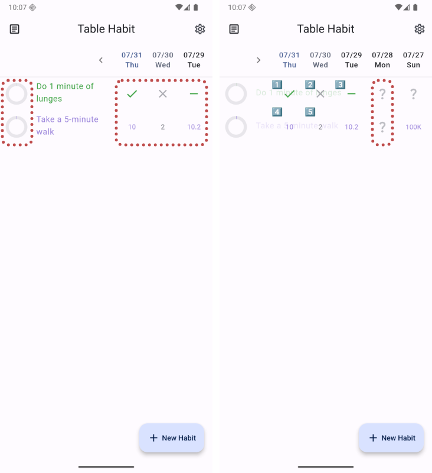
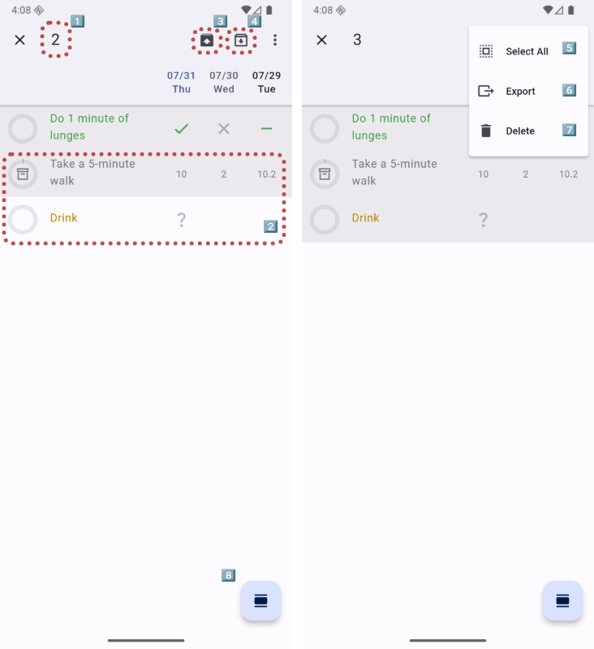
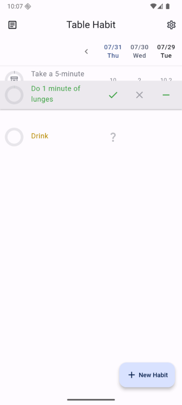
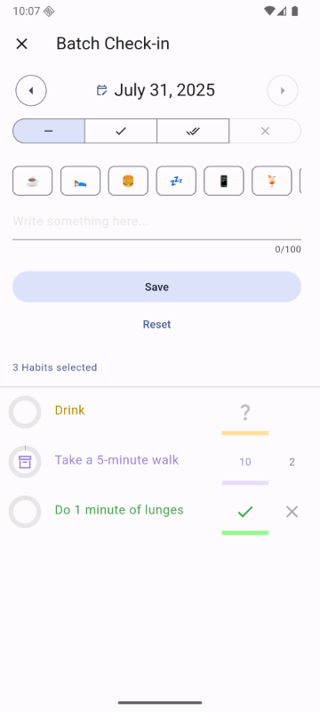
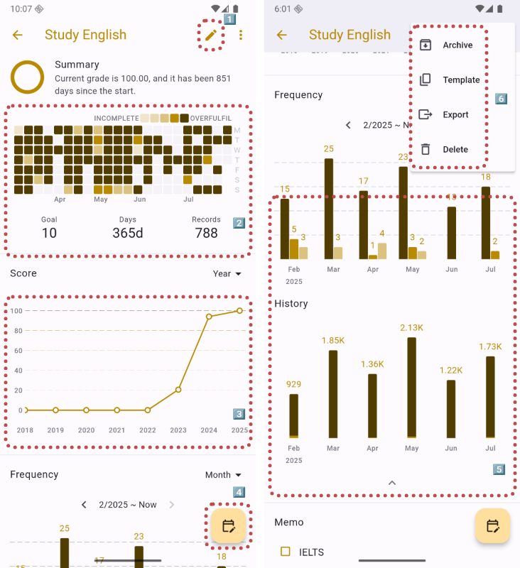
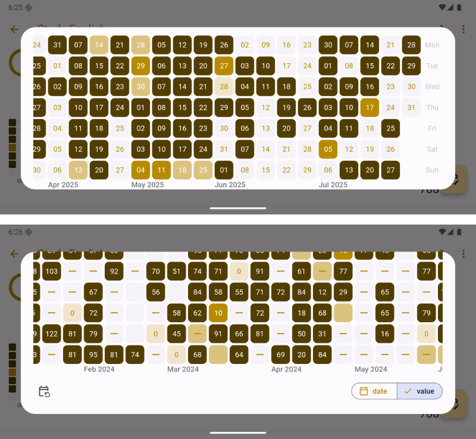
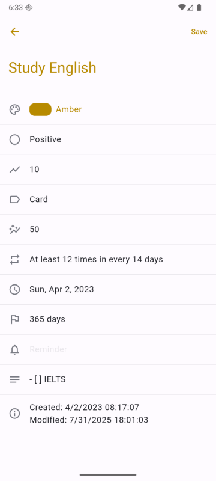

<!-- markdownlint-disable no-inline-html first-line-heading -->

Following sections are based on `Android` platform.
Others will be marked separately.
Contributions to this guide are welcome via [README#Contributing][readme-contributing].

## History

- _\[2025-07-31\]_: Initialize documentation, based on [**88efd12**][commit-88efd12] with version 'v1.16.22+91'.

## "Table Habit" Screen

The "Table Habit" Screen is the default view when app launched:


The blank area below the AppBar will display habit content after a habit is created. Other marked areas:

1. After clicking, some basic statistics will be shown.
2. Clicking allows you to expand or collapse the check-in table.
   The expanded view shows the status for more days (Collapsed by default).
3. `Setting` Button.
4. `New Habit` Button.

Once some habits are created and contain check-in information, the following details are included:



The left circular shows the habit score progress,right side is "check-in" area.
The check-in status is divided into the following types (using `"positive habits`" as an example):

- "❔": Indicates not yet checked in. It's treated the same as "❌" (not completed) when calculating score.

1. "✔️": Habit is exactly completed.
   This means the check-in value matches the "Daily Goal" quota configured in the habit’s meta info.
   The score will be increased accordingly, based on "Target Days" number and a curve-based algorithm.
2. "❌": Habit is not completed. The check-in value remains at **0**.
3. "➖": Habit has been skipped. No score will be deducted for today.
4. "<num>" (4, 5): Means the check-in value is any other number.
   Values greater than the "Daily Goal" are considered "over-completed" and will earn additional points (up to a certain limit).
   Conversely, values below the "Daily Goal" cause partial point deductions (less than the "❌" status), also based on a penalty algorithm.

## Create New Habit

By clicking "+ New Habit" FAB at the bottom-right, a creation screen will pop up:


To create a new habit, just fill in a form with the following fields:

- **[REQUIRED]** Name
- Color
- Type:
  Habits are divided into two types: _"Positive"_ and _"Negative"_.
  The type you choose will affect the meaning of several fields below.
- Daily Goal && Extra Goal (Below "Daily goal unit"):

  - "Positive":

    ```text
    Check-in Value →
    |--------|--------------------|------------------->
    0    Daily Goal         Extra Goal

    < Daily Goal: Incomplete
    = Daily Goal: Completed (base score)
    > Daily Goal, ≤ Extra Goal: Over-completed (extra score increases)
    ≥ Extra Goal: Max bonus reached
    ```

  - "Negative":

    ```text
    Check-in Value →
    |--------------|--------------------|------------------->
           Daily Goal           Extra Goal

    ≤ Daily Goal: Completed
    > Daily Goal, < Extra Goal: Incomplete (penalty increases)
    ≥ Extra Goal: Max penalty reached
    ```

- Goal Unit
- Completion rule: The following options are currently available:
  - Daily: Every day
  - X/week: Any X days per week
  - X/month: Any X days per month
  - X/Y days: X times in any rolling Y-day window,
    e.g. `3 times in 5 days: ✔️ ✔️ ✔️ ◻️ ✔️ ◻️ ❌ ...`
- Start Date
- Target Days: The minimum number of days required to reach the full score (100) without any deductions.
- Reminder: Set a scheduled reminder, a notification will appear when the time is reached.
  > Windows and Linux platforms are not supported yet.
- Description: Support `Markdown` format.

Once the required fields are completed, you can click `"Save"` button upper-right the screen to save and create.

## Select And Modify Habits

Long-pressing a habit enters **"Selection Mode"**. THis allows batch operations on multiple habits:



1. Selected habit count
2. Selected / Unselected: Background color of selected habits will become darker.
3. Archive selected habits
4. Unarchive selected habits
5. Select all visible habits
6. Export selected habits as `json` format, You can re-import from "Import" setting
   (**Note**: Exporting is not a sync method; imported habits will be treated as new habits).
7. Delete selected habits
8. Enter "Batch Check-in" screen. This will be explained in a [later section](#batch-check-in).

When long-pressing and held, current habit can be dragged up or down to change its position
(Habit order can only be changed under _"My Order"_ Sort mode).



## Batch Check-in

In **"Selection Mode"**, tap FAB at the bottom-right to enter **"Batch Check-in"** mode.



The left and right buttons allow selection of the date to modify.
The desired status can then be chosen from the bar below, and tapping **"Save"** will apply these changes.

- "—": Skipped
- "✓": Completed
- "✓✓": Overfulfilled
- "✗": Not completed

If there is an overwrite status, a confirmation dialog will appear after press **"Save"** button.

## Habit Detail

In the "Table Habit" screen, tapping on a habit navigates to the "Habit Detail" page.



1. Edit Button
2. Habit heatmap visually displays check-in activity.
3. Score changes graph can be viewed with selectable aggregation by day, week, month, or year.
4. Tap the FAB to enter "Heatmap Check-in" mode.
5. Another bar chart displays the check-in status.
6. Operation menu, see: ["Select And Modify Habits"](#select-and-modify-habits).

### Heatmap Check-in Mode

In "Heatmap Check-in" mode, check-in details can be shown more details than in “Habit Detail”,
and specific statuses can be modified by tapping or long-pressing.



> \* This screenshot uses landscape mode here for better display only.

## Edit Habit

Editing can be entered by clicking `Edit` button on either the “Selection Mode” or “Habit Detail” screens.



The edit page uses the same process as creating, see ["Create New Habit"](#create-new-habit) for all field definitions.

## Advanced settings

- [Sync habits across devices using WebDAV](./Feature꞉WebDAV-Sync)

<!-- refs -->

[readme-contributing]: https://github.com/FriesI23/mhabit#contributing
[commit-88efd12]: https://github.com/FriesI23/mhabit/tree/88efd124775e6a59f9830a1e9bc36c442075c4aa
